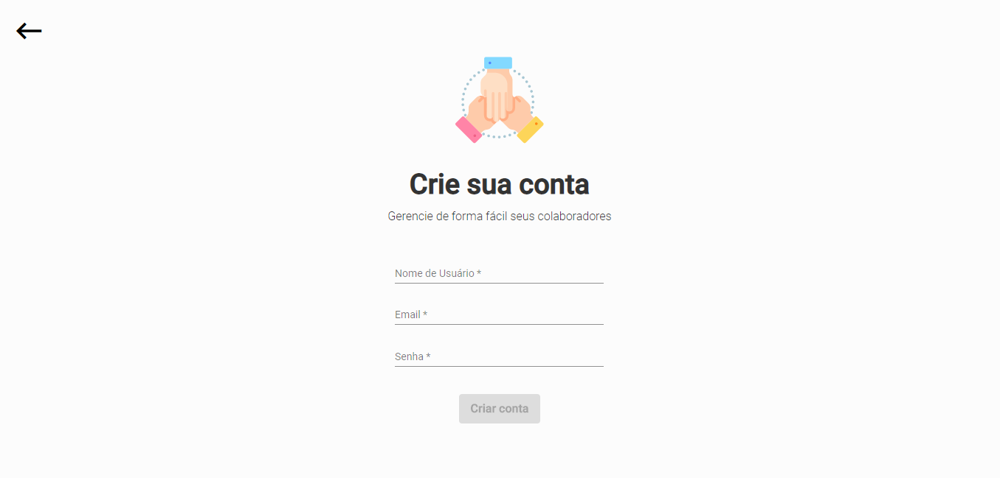
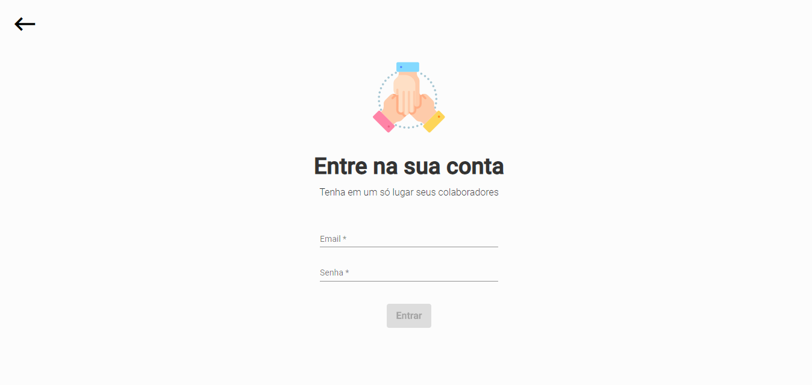
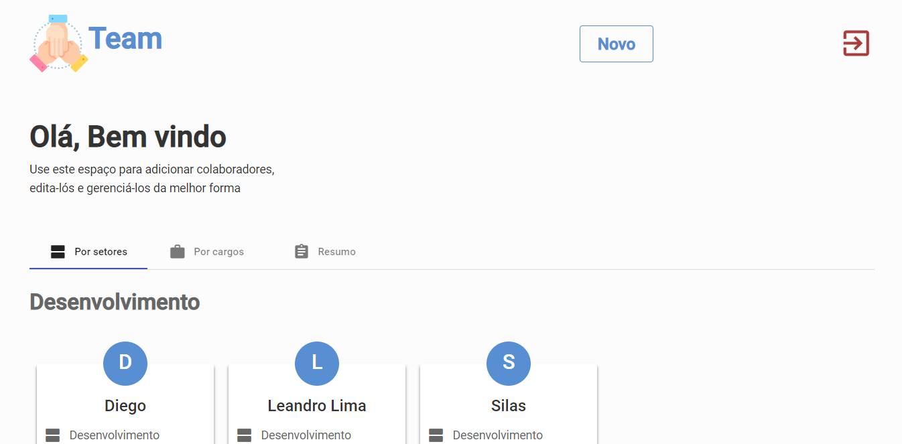
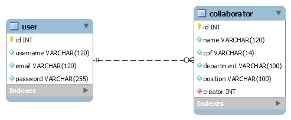

<div align="center">
  

  > 🖥️ Uma aplicação web para cadastro dos seus colaboradores bem como a melhor organização deles

  <a href="./LICENSE.md">
    
  </a>

  <a href="https://nodejs.org/en/">
    
  </a>

  <a href="https://www.npmjs.com/">
    
  </a>

  <a href="https://angular.io/">
    
  </a>

</div>
<br>

*******
<br>

## 🔖 Sumário
 - [📃 Descrição do Projeto](#description)
 - [✨ Layout da Aplicação](#preview)
 - [🎲 Modelagem de dados](#mer)
 - [🏭 Tecnologias Utilizadas](#techs)
 - [🚴 Colocando o projeto pra rodar](#run)
   - [🛠️ Pré Requisitos](#run-require)
   - [🤖 Iniciando o backend](#run-backend)
   - [🏕️ Iniciando o frontend Web](#run-frontend)
  - [📖 Licença](#license)

<br>

*******

<br>
<br>

<div id="description"></div>

## 📃 Descrição do Projeto

Este projeto é uma aplicação web com backend em NodeJS + Express que tem por finalidade o cadastro de colaboradores e também a possibilidade de editá-los, excluí-los e organizá-los por setor e cargo.

Esta aplicação foi proposta pela **Digiboard Eletrônica da Amazônia** como uma **Prova Prática** para a vaga de Desenvolvedor.

<br>
<br>

<div id="preview"></div>

## ✨ Layout da Aplicação

O layout da aplicação foi pensado para ser algo simples e de fácil uso como nas imagens abaixo.






<br>
<br>

<div id="mer"></div>

## 🎲 Modelagem de dados

A modelagem de dados proposta foi bem simples também e suficiente para o CRUD que seria criado na aplicação.



caso queira ver a modelagem no Mysql Workbench segue o [arquivo editável](./.github/team-mer.mwb)

<br>
<br>

<div id="techs"></div>

## 🏭 Tecnologias Utilizadas

O Projeto foi construído usando as seguintes tecnologias e ferramentas:
- **[Typescript](https://www.typescriptlang.org/)**
- **[NodeJS](https://nodejs.org/en/)**
- **[Npm](https://www.npmjs.com/)**
- **[Express](https://expressjs.com/pt-br/)**
- **[TypeORM](https://typeorm.io/#/)**
- **[MySQL](https://www.mysql.com/)**
- **[Angular](https://angular.io/)**
- **[Angular Material](https://material.angular.io/)**
- **[Eslint](https://eslint.org/)**


<br>
<br>

<div id="run"></div>

## 🚴 Colocando o projeto pra rodar

Então vamos para parte que mais interessa: **Colocar o projeto para rodar** e ver tudo funcionando.

Mas antes disso precisamos preparar o ambiente e já ter de antemão algumas coisas

<div id="run-require"></div>

### 🛠️ Pré Requisitos

Antes de qualquer coisa você deve possuir em sua máquina, já instalado, o **NodeJS**, o **NPM** e o **MYSQL**.

Além disso, sobre o MySQL:
  - Possuir usuário e senha
  - Criar um database com o nome de sua preferência para ser usado com a aplicação

E por último, não menos importante, a linha de comando do **Angular** que você pode adquirir usando:

```bash
$ npm install -g @angular/cli
```

<div id="run-backend"></div>

### 🤖 Iniciando o backend

Para começarmos nossos trabalhos no backend **abra o terminal** e entre na pasta `cd team/backend`.

> Lembrando que este terminal vai ser exclusivo para tratarmos o backend

Feito isso utilize um editor de texto para abrir o arquivo **ormconfig.json**.
<br>
Eu utilizo o VSCode, fique à vontade para usar o de sua preferência.

```bash
# Abra o arquivo
$ code ormconfig.json
```

Nele vamos configurar a conexão com o banco de dados bem como as credências (*seu usuário e senha do MySQL*) como no exemplo abaixo:

```json
{
  "host": "localhost",
  "port": 3306,
  "username": "root",
  "password": "",
  "database": "team",
}
```

Feito isso, agora copie e cole o arquivo `.env.example` e mude seu nome para `.env`.
<br>
Nele você deve adicionar uma `chave secreta` ou um conjunto de caracteres que você quer que sejam usados para codificar seu jwt como no exemplo abaixo (irá ajudar a gerar os tokens de autenticação para aplicação)

```javascript
JWT_SECRET='TEAM_SECRET_JWT'
```

Tomei a liberdade de automatizar alguns comandos utilizando o `package.json` e agora iremos usá-los para colocar o backend pra funcionar

```bash
# Vamos instalar primeiro as dependência do backend
$ npm install

# Após isso vamos executar as migrations
$ npm run migration:run

# Agora sim colocamos para rodar
$ npm run dev 
```

Com isso o backend estará iniciado no endereço `http://localhost:3333` e já será possível fazer algumas requisições atraves do Insomnia ou Postman.

[](https://insomnia.rest/run/?label=teamApp&uri=)


<div id="run-frontend"></div>

### 🏕️ Iniciando o frontend Web

Para começarmos nossos trabalhos no frontend web **abra outro terminal** ou nova aba no terminal se houver suporte e entre na pasta `cd team/web`.

> Lembrando que este terminal vai ser exclusivo para tratarmos o frontend web

Com o terminal aberto dentro da pasta utilizaremos os comandos para iniciar o projeto

```bash
# Instale a CLI do Angular caso não tenha instalado ainda
$ npm install -g @angular/cli

# Instale as dependências do Frontend
$ npm install

# Inicie o frontend
$ ng serve --port 3000 -o
```

Com isso a aplicação irá abrir automaticamente no seu navegador no endereço `http://localhost:3000`


<br>
<br>

<div id="license"></div>

## 📖 Licença

Realizado em 2020

Esse projeto está licenciado pela MIT LICENSE. Para mais informações, leia o arquivo [LICENSE](./LICENSE.md).